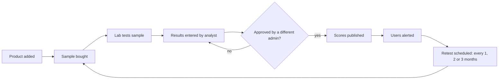

# TrueLabel — Product Requirements Document (v1)

Last updated: 27 Sep 2026. Mirrors the shared PRD doc `TrueLabel_PRD_v1`. Scoring details live in `SCORING.md`; technical design in `ARCHITECTURE.md`.

## 1. Overview

TrueLabel is a mobile app that tells people what is really in packaged food, backed by our own recurring independent lab tests rather than the manufacturer's label alone.

**The problem.** Nutrition labels are self-reported by brands and rarely audited. Protein, sugar, sodium and fat can differ from what is printed. Contaminants (heavy metals, pesticide residue, microbial load) and additives are not visible to shoppers. Health-conscious consumers have no trusted, independent way to check.

**The solution.** We buy products off retail shelves, send them to accredited labs on a fixed cycle (every 1–2 months for most products), compare results to the label, and publish per product:

- **Label Accuracy Score (0–100)**: how closely lab results match what the label claims.
- **Food Grade (A–F)**: how good the product is for you, based on lab-verified nutrition, additives and contaminants.
- **Safety status (Safe / Caution / Unsafe)**: a hard gate based on FSSAI contaminant limits.

**Vision.** Become the trusted, independent reference for food quality in India: the place people check before they buy, and a pressure on brands to label honestly.

### Goals for v1

- Launch in India on Android and iOS with about 20 lab-tested products, on a platform that scales to 300+ products without rework.
- Let a user find any listed product in under 10 seconds (search or barcode scan).
- Prove willingness to pay through a Premium subscription.

### Non-goals for v1

- Scoring products we have not lab-tested (no crowd-sourced or label-only scores).
- Fresh produce, restaurant food, supplements and cosmetics.
- Personalised diet or medical advice.

## 2. Target users

The core user is a health-conscious shopper who reads labels, distrusts marketing claims, and will pay for certainty.

| Persona | Who they are | What they need |
| --- | --- | --- |
| Fitness tracker | Gym-goer counting protein and calories; buys whey, protein bars, oats | Proof that protein and calorie numbers are real |
| Careful parent | Buys snacks, cereals, baby food for young children | Contaminant and additive checks; simple "safe or not" answer |
| Condition manager | Managing diabetes, hypertension or allergies | Verified sugar and sodium; allergen and additive flags |
| Clean-eating enthusiast | Prefers minimally processed, additive-free food | Ingredient and additive breakdown; better alternatives |

Secondary audiences (post-MVP): nutritionists and dietitians, and brands that want to be verified.

## 3. User roles and permissions

Six roles cover the MVP; brand partner comes later.

| Role | Who | Can do | Cannot do | MVP |
| --- | --- | --- | --- | --- |
| Guest | Not signed in | Search, browse, see Food Grade, Label Accuracy and Safety status | Save, request, see full lab data | Yes |
| Free member | Signed-in user | Guest features + favourites, scan history, request and upvote tests | Full lab report, history, alerts, compare | Yes |
| Premium member | Paying subscriber | Full label-vs-lab data, contaminant results, lab report PDF, score history, compare, alerts, double-weight votes | Edit any data | Yes |
| Lab analyst | Internal staff / lab partner | Create test batches, upload lab reports, enter results | Approve or publish scores | Yes |
| Content admin | Internal staff | Manage products, brands, categories, label data, additives; review and publish scores; manage request queue | Change roles or billing | Yes |
| Super admin | Founder / ops lead | Everything, including staff roles, scoring configuration, plans | — | Yes |
| Brand partner | Manufacturer | View own results, respond publicly, dispute with evidence | Change scores or lab data | Post-MVP |

**Integrity rule:** the person who enters lab results cannot approve or publish them. Every published score keeps an audit trail of who entered, reviewed and approved it.

## 4. Scoring (summary)

Full algorithms, constants and test vectors: `SCORING.md`.

- **Safety status**: Unsafe if any contaminant exceeds its FSSAI limit (Food Safety and Standards (Contaminants, Toxins and Residues) Regulations, 2011); Caution if any contaminant is above 50% of its limit or an undeclared allergen is detected; otherwise Safe. Unsafe forces Food Grade F.
- **Label Accuracy Score**: weighted per-nutrient deviation between lab and label, with a tolerance band (default ±10%) and a 1.5× penalty when the label misleads in the harmful direction. Bands: 90–100 Accurate, 70–89 Minor gaps, 50–69 Misleading, below 50 Inaccurate.
- **Food Grade**: composite of nutritional quality (45%, benchmarked within category), contaminants (25%), additives (20%), processing level (10%). A ≥ 80, B ≥ 65, C ≥ 50, D ≥ 35, E ≥ 20, F below.
- Label accuracy does not affect Food Grade; both are shown side by side ("is it good" and "is it honest").
- **Test cycles**: per-product frequency of 1 month (high-traffic or previously failing), 2 months (default) or 3 months (stable). A product more than 30 days past its retest date is marked **Stale**. Every cycle's history is kept.

## 5. User workflows

### 5.1 First launch
1. Splash and 3-screen intro: what the scores mean; results come from real lab tests.
2. Optional goal picker: high protein, low sugar, low sodium, additive-free, kid-safe.
3. Browse as guest, or sign up.

### 5.2 Check a product (core loop)
1. Home: search bar, scan button, recently tested, top-rated by category.
2. Find the product by barcode scan, search by name/brand, or category browse.
3. Product page shows Food Grade, Label Accuracy, Safety status and last-tested date at a glance.
4. Detail: label-vs-lab table, additives with concern levels, contaminant results, score history (Premium parts locked).
5. Act: save, compare (up to 3), see better-rated alternatives, share.

### 5.3 Product not found
1. Scan or search returns no match → "Not tested yet".
2. **Request testing** button (sign-in required). Request joins a public queue; others upvote (Premium votes count double).
3. Requester is notified when the product is tested.

### 5.4 Upgrade
1. Premium content shown blurred with "Unlock with Premium".
2. Paywall: monthly and annual plans, free trial (prices TBD after market research).
3. Purchase via App Store / Google Play; unlocks immediately.

### 5.5 Internal testing cycle

## 6. Features and MVP scope

The MVP proves people will pay for independently verified food scores: a searchable, scannable catalogue of lab-tested products, a Premium tier, and internal tools to run the testing cycle.

### 6.1 MVP features

| Area | Feature | Tier |
| --- | --- | --- |
| Discovery | Search by product name, brand, category | Free |
| Discovery | Barcode scanner (EAN-13 first, also UPC-A, EAN-8) with instant match | Free |
| Discovery | Browse by category; filter by grade, safety, accuracy band; sort by score or recently tested | Free |
| Product page | Food Grade, Label Accuracy, Safety status, last and next test date | Free |
| Product page | Ingredient list with additives flagged by concern level | Free |
| Product page | Full label-vs-lab table, contaminant results, lab report PDF | Premium |
| Product page | Score history across test cycles | Premium |
| Product page | Better-rated alternatives in the same category | Free (top 1), Premium (all) |
| Compare | Side-by-side comparison of up to 3 products | Premium |
| Account | Sign up / sign in, profile, dietary goals | Free |
| Account | Favourites and scan history | Free |
| Engagement | Request a product to be tested; upvote requests | Free |
| Engagement | Push alerts when a saved product is retested or its score changes | Premium |
| Trust | "How we score" page: methodology, labs, test frequency, independence policy | Free |
| Monetisation | Premium subscription (monthly, annual, trial) via in-app purchase | — |
| Admin | Web admin panel: products, brands, categories, label data, test batches, results entry, review and publish, request queue, users | Internal |
| Admin | Automatic score calculation from entered results; audit log | Internal |

### 6.2 Post-MVP ideas

Personalised fit score; shopping list and basket grade; recall and safety alerts; leaderboards (most honest brands); brand portal; community-funded tests; nutritionist accounts; B2B data API; web app / PWA; Hindi and regional languages.

## 7. Data

Entities: User/Profile, Subscription, Brand, Category (with nutrition benchmarks), Product (multiple barcodes), LabelVersion (versioned label data incl. FSSAI licence no. and veg/non-veg mark), Additive, Lab, TestParameter, TestBatch, TestResult, LabReport, Score (full history, never edited in place), Favourite, ScanHistory, TestRequest (+ votes), Notification, AuditLog. Full schema: `ARCHITECTURE.md`.

## 8. Platforms and non-functional requirements

- Mobile app for iOS and Android (React Native + Expo). Admin panel on web. PWA later.
- Product page loads in under 2 s on 4G; barcode match under 1 s.
- Favourites and recently viewed products available offline (cached).
- 99.5% uptime for the consumer API.
- Data encrypted in transit and at rest.
- Admin actions role-checked and audit-logged.
- **Scale:** launch with ~20 products; catalogue, search, scoring and admin must handle 300+ products and thousands of test batches with no redesign.

### India launch requirements

- **Food regulation:** contaminant limits from FSSAI Contaminants, Toxins and Residues Regulations, 2011; label data per FSSAI Labelling and Display Regulations, 2020. A regulatory advisor confirms both before launch.
- **Extra label fields:** FSSAI licence number and veg / non-veg mark per label version.
- **Barcodes:** EAN-13 (GS1 India, 890 prefix) supported first.
- **Data protection:** Digital Personal Data Protection Act, 2023 and DPDP Rules, 2025 (notified November 2025; most obligations apply from around May 2027). Build consent notices, data export and account deletion into v1.
- **Devices:** Android is the larger share of Indian users; test on low- and mid-range Android phones and keep the app light.
- **Pricing:** INR via Google Play and App Store billing.
- **Language:** English at launch; Hindi and regional languages later.
- **Legal:** review score wording and publication policy with an Indian lawyer (defamation, brand disputes).

## 9. UI/UX (summary)

Verdict first, evidence one tap below, never colour alone, calm clinical tone, scan reachable from everywhere, honest paywall. Bottom tabs: Home · Search · Scan · Saved · Profile. Full spec: `DESIGN.md`.

## 10. Business

**Monetisation:** freemium subscription. Revenue never comes from brands in a way that could influence scores. Lab testing is the main cost: ~20 products retested every 1–2 months ≈ 120–240 lab tests a year.

**Success metrics:** weekly active users; scans and searches per active user; search/scan hit rate; free → Premium conversion; trial → paid and monthly churn; test requests and upvotes; lab cost per product per cycle vs revenue per user.

**Risks:** legal action from brands (accredited labs, published methodology, retained samples, legal review); small launch catalogue (focus 1–2 categories, prominent request queue, lighter paywall early); lab costs (tiered frequency, demand-based priority); unrepresentative samples (multiple stores/batches, show batch info); perceived bias (independence policy, audit trail).

### Decisions and open questions

| Question | Status | Answer |
| --- | --- | --- |
| Launch market | Decided | India |
| Launch catalogue | Decided | ~20 products; must scale to 300+ |
| Default retest frequency | Decided | Every 1–2 months for most products |
| Product name | Decided | TrueLabel |
| Lab partner(s) and standard test panel | Open | In-house or outsourced; which tests per cycle |
| Launch categories | Open | Which 1–2 categories the first 20 products come from |
| Premium price and free trial | Open | Needs market research |
| Scoring sign-off by food scientist / nutritionist | Open | |
| Timeline and team size | Open | |
